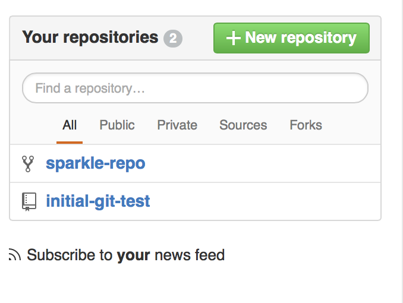
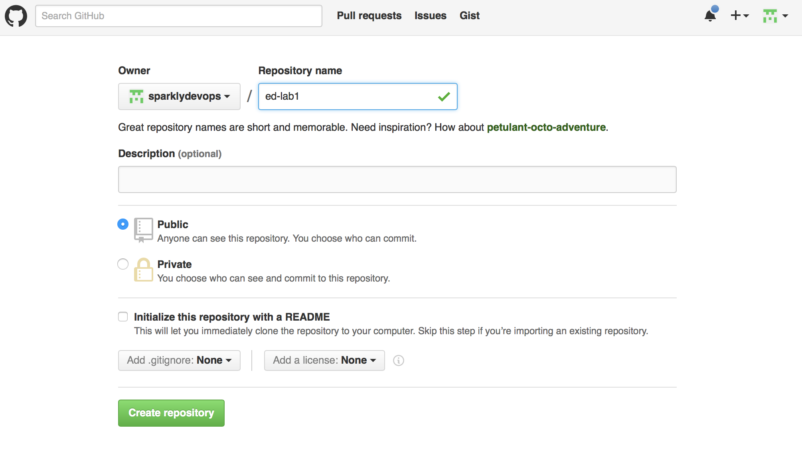
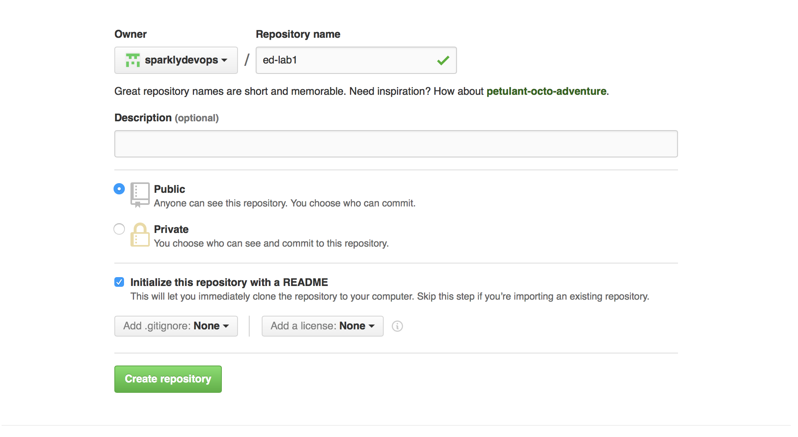
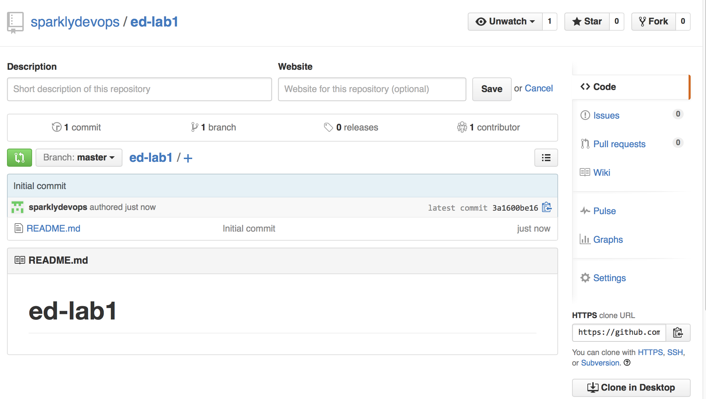
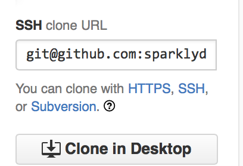
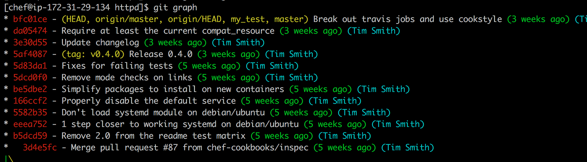

## Lab 1
## Verify Local Environment
Allotted Time: 10 minutes

## Overview

In this exercise each participant configures and tests a local development environment and registers for the Community Slacks.

## Connect to Node (Everyone)

* ssh chef@NODE 

If you don't have ssh available please downlowd an ssh client. For Windows, a good option is [putty](http://www.putty.org/).


## Introduction to Git

## Customize your workstation (Everyone)

```
   git config --global user.name "YOUR NAME"
   git config --global user.email "YOUR EMAIL ADDRESS"

```

Example: 

```
$ git config --global user.name "Jennifer Davis"
$ git config --global user.email "sparklydevops@gmail.com"
```

## Verify .gitconfig creation (Everyone)

```
   cat ~/.gitconfig
```

Example:

```
   cat ~/.gitconfig
[user]
   name = Jennifer Davis
   email = sparklydevops@gmail.com
```

## Set your preferred git editor (Everyone)

If you don't set your preferred editor, it will use the default text editor for the system.

* emacs
* nano
* vi/vim

```
   git config --global core.editor EDITORNAME
```

Example:
```
$ git config --global core.editor nano
```

## Add any additional desired git aliases (Optional)


## Verify the configuration (Everyone)

```
   git config --list
```

Example Output:

```
[sumac@ip-10-0-0-107 ~]$ git config --list
user.name=Jennifer Davis
user.email=sparklydevops@gmail.com
core.editor=vi
```

## Create a project Directory (Everyone)

```
   mkdir wd
   cd wd
```

## Create initial project (Everyone)

```
   mkdir hello_world
   cd hello_world
   git init 
   git status
```

Expected Output
```
[chef@ip-172-31-11-246 hello_world]$ git status
On branch master

Initial commit

nothing to commit (create/copy files and use "git add" to track)
```

Create hello.txt file:

```
   echo "hello world" >> hello.txt
   git status
   git add hello.txt
   git status
   git commit -m "creation of hello.txt file"
   git status

```

Example of first status output:

```
 git status
On branch master

Initial commit

Untracked files:
  (use "git add <file>..." to include in what will be committed)

   hello.txt

nothing added to commit but untracked files present (use "git add" to track)
```

Example of second status output:

```
[chef@ip-172-31-11-246 hello_world]$ git status
On branch master

Initial commit

Changes to be committed:
  (use "git rm --cached <file>..." to unstage)

   new file:   hello.txt
```

Example of third status output:

```
[chef@ip-172-31-11-246 hello_world]$ git status
On branch master
nothing to commit, working directory clean
```

## Create a GitHub identity (Everyone)

* If you don't already have a github account, create one.
* Browse to http://github.com. Supply a username, email address, and password.
* Free plan is fine. Other plans allow you to have private repositories.

## (Optional) Setting up your GitHub keys (Everyone)

If you want to skip the added burden of entering your username and password each time at the prompt with git, you can follow the steps here to set up your ssh keys:

https://help.github.com/articles/generating-ssh-keys/

Example output of successful setup of keys:

```
[sumac@ip-10-0-0-107 ~]$ ssh -T git@github.com
Hi sparklydevops! You've successfully authenticated, but GitHub does not provide shell access.
```


## Create a new remote repo

In a web browser, after logging into Github, you'll see an option to create a "New Repository" on the lower right.

Click on New Repository:



In the repository name field, enter `ed-lab1` and click the Initilize README option.: 




Once you have created the repo, you will see a screen like this:



On the lower right you will see the clone url. You can leave it with https and enter your credentials each time, or you can switch to ssh by clicking on SSH if you've set up your ssh keys.



## Clone new repo to node

On the node:

```
   cd ~/wd
   git clone git@github.com:YOURUSERNAME/ed-lab1.git
```

Example:
```
[chef@ip-172-31-11-246 wd]$ git clone git@github.com:sparklydevops/ed-lab1.git
Cloning into 'ed-lab1'...
remote: Counting objects: 3, done.
remote: Total 3 (delta 0), reused 0 (delta 0), pack-reused 0
Receiving objects: 100% (3/3), done.
Checking connectivity... done.
```

Check the contents of the repository you just cloned

```
  cd ~/wd/ed-lab1
  ls
  git remote -v
```

## Add hello.txt to your ed-lab1 repo

Copy the hello.txt file from the previous exercise into your ed-lab1 repository.

```
cp ~/wd/hello_world/hello.txt .
git status
git add hello.txt
git status
git commit -m "adding hello.txt to repository"
```

## Sharing updates to remote repository

At this point we have added the file to our local repository but not to our remote repository. 

```
git push origin master
```


# Examine .gitconfig

## Git Aliases

You can create aliases for frequently used commands. I use the alias git graph in order to get a nice git log output in combination with using git color features.

```
git config --global alias.graph log --graph --pretty=format:'%Cred%h%Creset -%C(yellow)%d%Creset %s %Cgreen(%cr)%Creset %C(cyan)(%an)%Creset' --abbrev-commit --date=relative
```

The --graph option creates a text based graphical representation of the commit history.

With the --pretty flag, you can specify a formating string.

The format string allows us to focus on what we want to see when looking at the history of commits. In this alias, the symbols translate to showing us the following information in the specific colors.

```
%h: abbreviated commit hash
%d: ref names
%s: subject
%cr: committer date, relative
%an: author name

```

Finally --date=relative shows dates relative to the current time, e.g. “2 hours ago”.

Git color allows you to configure your terminal to improve the terminal output of git commands.

My view when using git graph:




```
[alias]
  graph = log --graph --pretty=format:'%Cred%h%Creset -%C(yellow)%d%Creset %s %Cgreen(%cr)%Creset %C(cyan)(%an)%Creset' --abbrev-commit --date=relative
[color]
  ui = true
[color "branch"]
    current = yellow reverse
    local = yellow
    remote = green

[color "diff"]
    meta = yellow bold
    frag = magenta bold
    old = red bold
    new = green bold

[color "status"]
    added = yellow
    changed = green
    untracked = red
```

Examining dotfiles repos is very instructive in learning new options to improve your experience.

* Fletcher Nichols - https://github.com/fnichol/dotfiles

Example from Ian Henry

```
graph = log --graph --abbrev-commit --decorate --format=format:'%C(bold blue)%h%C(reset) - %C(bold green)(%ar)%C(reset) %C(white)%s%C(reset) %C(dim white)- %an%C(reset)%C(bold yellow)%d%C(reset)' --all
```
## Join the Chef Community Slacks

Follow the instructions on the [Chef Community Slack Page](http://community-slack.chef.io/) and then sign in to the Chef Community Slack. You can either use Slack from a web browser or from the app. 

Join the [Habitat Community Slack](http://slack.habitat.sh).

Send a message to user sigje on the Chef Community Slack with your github identity.

## Outcomes

* You will have logged into your node and configured git.
* You will have signed up for the Chef and Habitat Community Slack.
* You will have shared your github identity 
* You will have created a remote repository and synced local repository with remote

\pagebreak